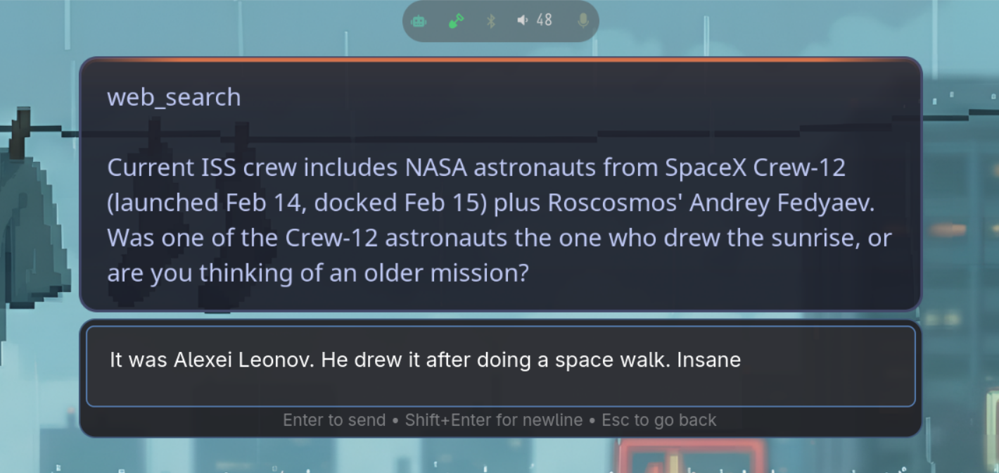

# aside

Wayland-native LLM assistant. You ask it something, it streams the answer onto a floating overlay on your desktop, then fades away.


- **Overlay** — C layer-shell surface. Streams tokens in real time, auto-dismisses. Hover to keep it around, right-click to cancel.
- **Voice** — STT via faster-whisper, TTS via Kokoro. Talk to it, it talks back.
- **Actions bar** — pops up after a response with mic, transcript, and reply buttons.
- **Input popup** — GTK4 window with conversation history. Continue one or start fresh.
- **Tools** — ships with shell, memory, and web search. Drop a Python file with `TOOL_SPEC` + `run()` into a plugins directory to add more.
- **Any LLM** — [LiteLLM](https://github.com/BerriAI/litellm) under the hood. Claude, GPT, Gemini, Ollama, whatever you want.




## Install

```bash
git clone https://github.com/scottstav/aside.git
cd aside
make install
systemctl --user enable --now aside-daemon aside-overlay
```

Optionally:

```bash
make install-extras-voice  # faster-whisper + VAD
make install-extras-tts    # kokoro
make install-extras-gtk    # input popup
```

## Docs

| | |
|---|---|
| [Installation](docs/install.md) | Dependencies, build, AUR |
| [Usage](docs/usage.md) | CLI reference |
| [Configuration](docs/configuration.md) | Config options |
| [Plugins](docs/plugins.md) | Plugin API |
| [Architecture](docs/architecture.md) | System design |

MIT
