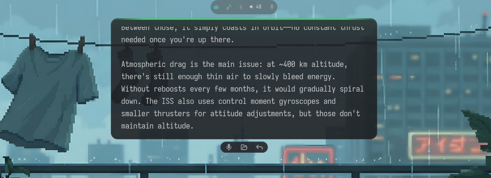
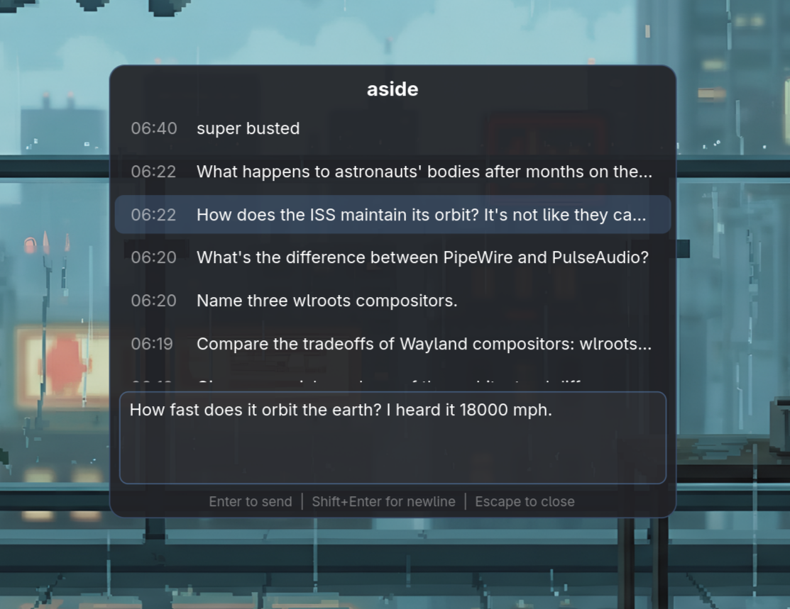

# aside

Wayland-native LLM assistant. Ask it something, it streams the answer onto a floating overlay on your desktop, then gets out of the way.



- **Overlay** — C11 layer-shell surface, streams tokens in real time, auto-dismisses. Hover to keep it, right-click to cancel.
- **Voice** — STT via faster-whisper, TTS via Kokoro. Talk to it, it talks back.
- **Actions bar** — pops up after a response with mic, open transcript, and reply buttons.
- **Input popup** — GTK4 window with conversation history. Pick one to continue or start fresh.
- **Plugins** — drop a Python file with `TOOL_SPEC` + `run()` in a directory. Ships with shell, screenshot, web search, memory, clipboard.
- **Any LLM** — [LiteLLM](https://github.com/BerriAI/litellm) under the hood. Claude, GPT-4o, Gemini, Ollama, whatever.



## Install

```bash
git clone https://github.com/scottstav/aside.git
cd aside
make install
systemctl --user enable --now aside-daemon aside-overlay
```

Optional:

```bash
make install-extras-voice  # faster-whisper + VAD
make install-extras-tts    # kokoro
make install-extras-gtk    # input popup
```

## Docs

| | |
|---|---|
| [Installation](docs/install.md) | Dependencies, build, AUR |
| [Usage](docs/usage.md) | CLI reference |
| [Configuration](docs/configuration.md) | Config options |
| [Plugins](docs/plugins.md) | Plugin API |
| [Architecture](docs/architecture.md) | System design |

MIT
