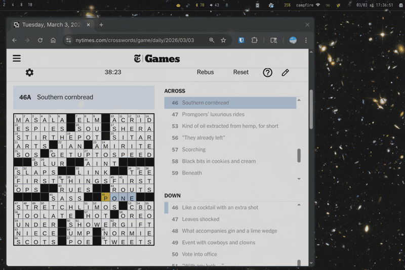
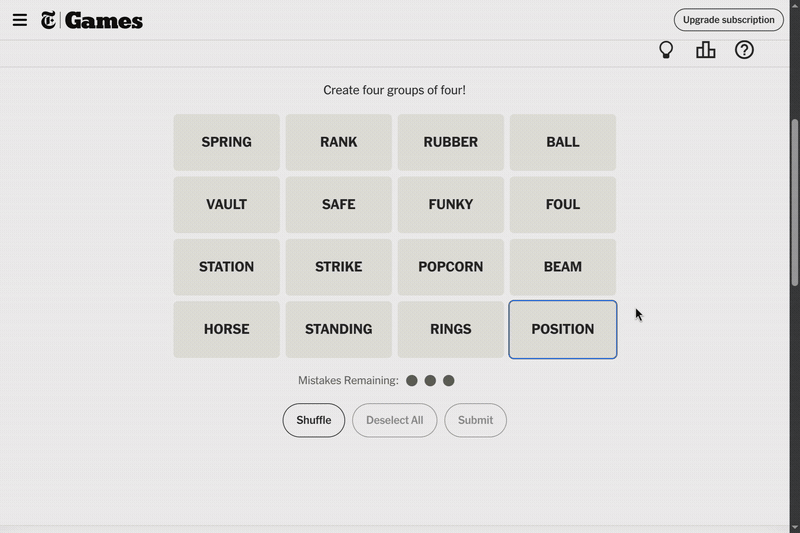

# aside

An LLM assistant for Wayland desktops that does what you ask and gets out of the way. Configurable to fit your look. Infinitely extensible with custom tools.

[](https://ko-fi.com/scottstav) [](#donate) [](#donate)





- **overlay** — C layer-shell surface. Streams tokens in real time. Reply or open full transcript with inline actions. Left click to dismiss, right-click to cancel query, middle click to mute TTS. **Very** customizable.
- **voice** — STT via faster-whisper, TTS via Piper (optional add-ons).
- **input popup** — GTK4 window with conversation history. Continue one or start fresh.


Bind `aside query --mic` to a hotkey and start talking. Aside detects silence and automatically sends your query.

## tools

Where the magic happens

aside ships with a memory tool built in. To add your own, just drop a Python file with a `TOOL_SPEC` + `run()` into a tool directory and the daemon picks it up automatically (requires restart). See `examples/tools/` for reference implementations.

The tool system is flexible enough to do real work.

Be a cheater:


launch a [wreccless](https://github.com/scottstav/wreccless) worker:


## any LLM

[LiteLLM](https://github.com/BerriAI/litellm) under the hood — Claude, GPT, Gemini, Ollama, whatever. aside auto-detects which providers are available based on your API keys.

## API keys

keys are stored securely with a sane fallback chain:

1. **environment variables** — checked first
2. **GNOME Keyring** (via `secret-tool`) — if available
3. **KWallet** (via `kwalletcli`) — if available
4. **`~/.config/aside/env`** — plaintext fallback (mode 0600)

```bash
aside set-key anthropic sk-ant-...
aside set-key openai sk-...
```

## CLI

everything goes through the CLI, which makes it easy to script, integrate with pickers, or wire into status bars.


```bash
# models — auto-detects what's available based on your API keys
aside models
aside model set gemini/gemini-2.5-pro
aside model exclude openai/o1   # LiteLLM may identify available models that have actually been deprecated or are not "chat" models in which case they will error. Exclude them so they dont show in `aside models` list

# querying — rapid follow-ups auto-attach to the same conversation
aside query "what time is it in tokyo"
aside query --mic
aside reply abc123 "tell me more"

# state
aside status                    # JSON, great for status bars
aside ls                        # recent conversations
aside show <id>                 # print conversation
aside open <id>                 # open as markdown

# voice
aside toggle-tts
aside stop-tts
aside cancel
```

a GUI for continuing conversations is provided if you don't want to script your own:


## theming and customization

Highly configurable via `~/.config/aside/config.toml`, overlay position, colors, fonts, size.

```toml
[model]
name = "anthropic/claude-haiku-4-5"

[input]
font = "Iosevka 12"

[storage]
archive_dir = "~/Dropbox/LLM/Chats"

[tools]
dirs = ["~/.config/aside/tools"]

[overlay]
position = "top-center"
font = "Iosevka 12"
max_lines = 5
corner_radius = 8
border_width = 1
accent_height = 4
scroll_duration = 200
fade_duration = 400
width = 450
margin_top = 5
padding_top = 2.5

[overlay.colors]
background = "#1a1c1ee6"
foreground = "#d4d4d4ff"
border = "#5a4a3aff"
accent = "#5b9a6a"
user_accent = "#a07048"

[voice]
enabled = false
stt_model = "base"
stt_device = "cpu"
smart_silence = true
silence_timeout = 2.5
no_speech_timeout = 3.0

[tts]
enabled = false
speed = 1.0
filter = {skip_code_blocks = true, skip_urls = true}
```

voice, TTS, model, plugins, and storage are all configurable too — see [config reference](docs/configuration.md).

## requirements

- **Wayland compositor with layer-shell support** — Sway, Hyprland, KDE Plasma 6+, or any compositor implementing `zwlr_layer_shell_v1`. GNOME is **not** supported (the overlay won't render; the input popup will fall back to a regular window).
- **PipeWire** — required for audio (TTS playback and STT mic capture).

## install

### arch linux (AUR)

```bash
yay -S aside
aside set-key anthropic sk-ant-...
systemctl --user enable --now aside-daemon aside-overlay
```

#### optional add-ons

```bash
# speech-to-text (faster-whisper, ~100MB model download)
sudo aside enable-stt

# text-to-speech (piper-tts, ~60MB voice model)
sudo aside enable-tts
```

STT requires `pipewire` (provides `pw-record`) and `python-numpy` — both are already pulled in by the AUR package. TTS requires `portaudio` — also included.

### manual

`make install` builds the C overlay and Python package into a venv at `~/.local/lib/aside/venv/`, then symlinks executables (`aside`, `aside-overlay`, `aside-input`, `aside-reply`) into `~/.local/bin/`. Make sure `~/.local/bin` is in your `PATH`.

First install the build dependencies for your distro:

<details>
<summary>Fedora / RHEL</summary>

```bash
sudo dnf install -y gcc make meson ninja-build \
  cairo-devel pango-devel json-c-devel wayland-devel wayland-protocols-devel \
  python3-pip python3-devel \
  gtk4-devel libadwaita-devel gtk4-layer-shell-devel \
  gobject-introspection-devel python3-gobject python3-cairo
```
</details>

<details>
<summary>Ubuntu / Debian</summary>

```bash
sudo apt install -y gcc make meson ninja-build \
  libcairo2-dev libpango1.0-dev libjson-c-dev libwayland-dev wayland-protocols \
  python3-pip python3-dev python3-venv \
  libgtk-4-dev libadwaita-1-dev libgtk4-layer-shell-dev \
  libgirepository1.0-dev python3-gi python3-gi-cairo gir1.2-gtk-4.0
```
</details>

<details>
<summary>Arch (if not using the AUR package)</summary>

```bash
sudo pacman -S --noconfirm gcc make meson ninja \
  cairo pango json-c wayland wayland-protocols \
  python python-pip \
  gtk4 libadwaita gtk4-layer-shell \
  gobject-introspection python-gobject python-cairo
```
</details>

Then build and install:

```bash
git clone https://github.com/scottstav/aside.git
cd aside
make install
aside set-key anthropic sk-ant-...
systemctl --user enable --now aside-daemon aside-overlay
```

#### optional add-ons

The enable commands pip-install the Python packages into aside's venv but rely on a few system libraries:

| Add-on | Command | System deps |
|--------|---------|-------------|
| STT | `sudo aside enable-stt` | `pipewire-utils` (Fedora) · `pipewire` (Arch, Ubuntu) — for `pw-record` <br> `python3-numpy` (Fedora) · `python-numpy` (Arch) · `python3-numpy` (Ubuntu) |
| TTS | `sudo aside enable-tts` | `portaudio` (Arch, Fedora) · `libportaudio2` (Ubuntu) |

Install the system deps first, then run the enable command:

```bash
# example for Fedora:
sudo dnf install -y pipewire-utils python3-numpy portaudio

sudo aside enable-stt   # speech-to-text
sudo aside enable-tts   # text-to-speech
```

## donate

<a id="donate"></a>

| | |
|---|---|
| Ko-fi | [ko-fi.com/scottstav](https://ko-fi.com/scottstav) |
| BTC | `bc1q7xeyf4k0ud3akgch8svjwmdmeucr5mxx8lt4h6` |
| XMR | `864dQBZ5LTDhcUFX2P5mxV4ubjxLNFvCa4p8xLGd9b3XAEbeXXGrUa6M78eftfUpQkFk81BHrSHeCGXoQCXMcRGRTu8cM4u` |

MIT
