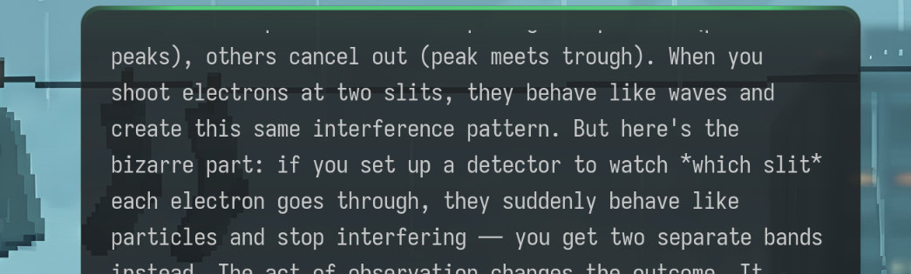
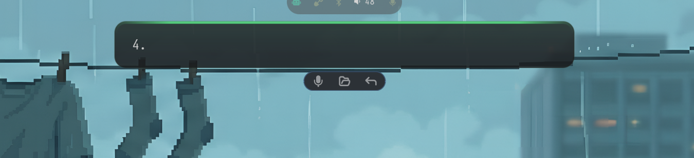

# aside

An AI assistant that lives on your Wayland desktop. Ask it anything — by typing, by voice, or from your status bar — and watch the response stream in real time on a floating overlay. Then reply, keep talking, or walk away. It fades out on its own.


## The overlay

A glass-like floating panel that appears at the top of your screen when a response arrives. Words stream in token-by-token with smooth auto-scroll and edge fading. When the response finishes, it lingers briefly and fades away.



Hover to keep it on screen. Left-click to dismiss. Right-click to cancel mid-stream. The accent bar at the top changes color — orange when the AI is responding, green when it's listening to you.

When it's not active, it doesn't exist. No persistent window, no tray icon. Just your desktop.

## Reply without breaking flow

After a response finishes, a compact action bar slides in below the overlay:



- **Mic** — voice reply to continue the conversation
- **Open** — export the full conversation to markdown
- **Reply** — expand into a text input right there

Auto-dismisses after 5 seconds if you ignore it.

## Talk to it

Say a wake word and start talking. aside transcribes your speech with Whisper in real time and auto-sends when you stop — no button to press. The overlay shows your words as they're transcribed with a green accent bar so you know it's listening.

It talks back too. Responses are synthesized sentence-by-sentence with Kokoro TTS and played as the text streams in. Middle-click the overlay to stop the voice while the text keeps flowing.

## Input popup

A GTK4 window with your recent conversations. Pick one to continue or start fresh. Follows your system dark/light theme.


## Status bar

A waybar module shows the current model, session cost, and activity state. Click it to open the input popup. The icon changes when the assistant is thinking, running a tool, or speaking.


## Any LLM

Uses [LiteLLM](https://github.com/BerriAI/litellm) — works with Claude, GPT-4o, Gemini, Llama (via Ollama), Mistral, Groq, Together, and [dozens more](https://docs.litellm.ai/docs/providers). Switch models by changing one line in the config.

## Plugins

Drop a Python file into the plugins directory with a `TOOL_SPEC` and a `run()` function. The daemon picks it up automatically.

Built-in tools: **shell** (run commands), **screenshot** (capture + visual analysis), **web search**, **memory** (persistent across conversations), **clipboard**.

## Install

```bash
git clone https://github.com/scottstav/aside.git
cd aside
make install
systemctl --user enable --now aside-daemon aside-overlay
```

Voice, TTS, and the GTK input are optional:

```bash
make install-extras-voice  # wake word + speech-to-text
make install-extras-tts    # text-to-speech
make install-extras-gtk    # GTK4 input popup
```

## Docs

| | |
|---|---|
| [Installation](docs/install.md) | Dependencies, build steps, AUR |
| [Usage & CLI](docs/usage.md) | Commands, conversation management |
| [Configuration](docs/configuration.md) | Every config option explained |
| [Plugins](docs/plugins.md) | Writing and installing plugins |
| [Architecture](docs/architecture.md) | System design, socket protocol, data flow |

## License

MIT
